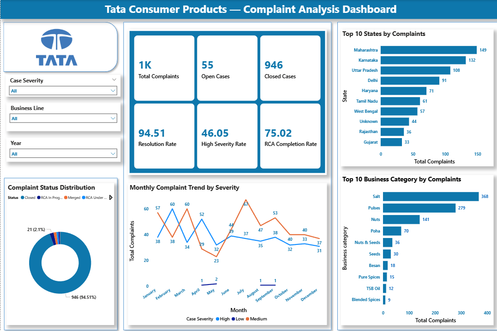
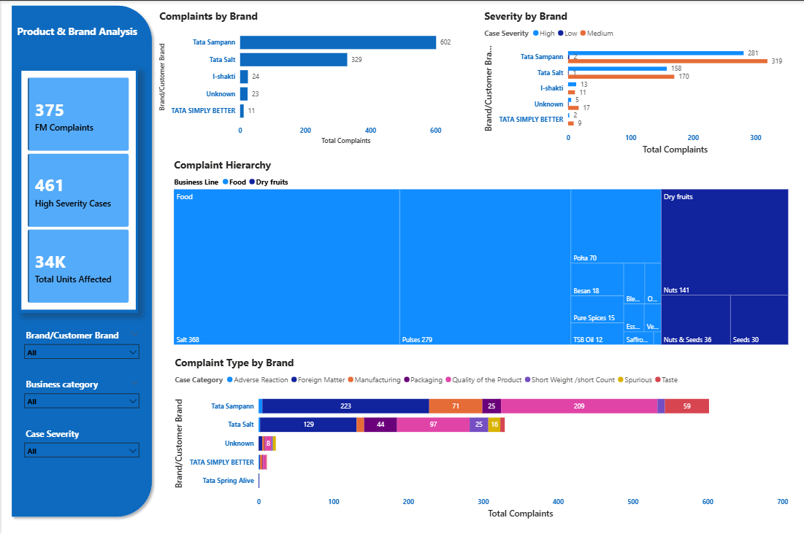
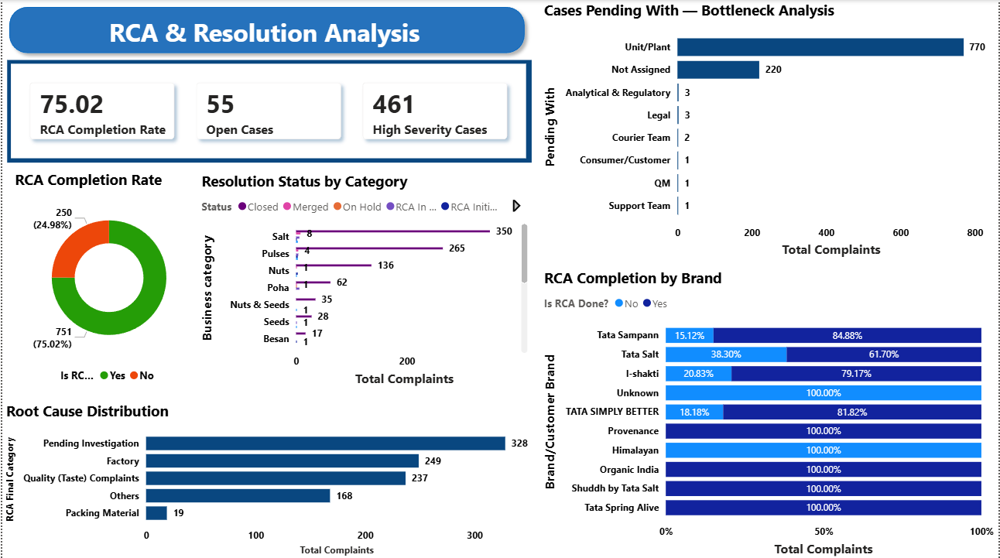
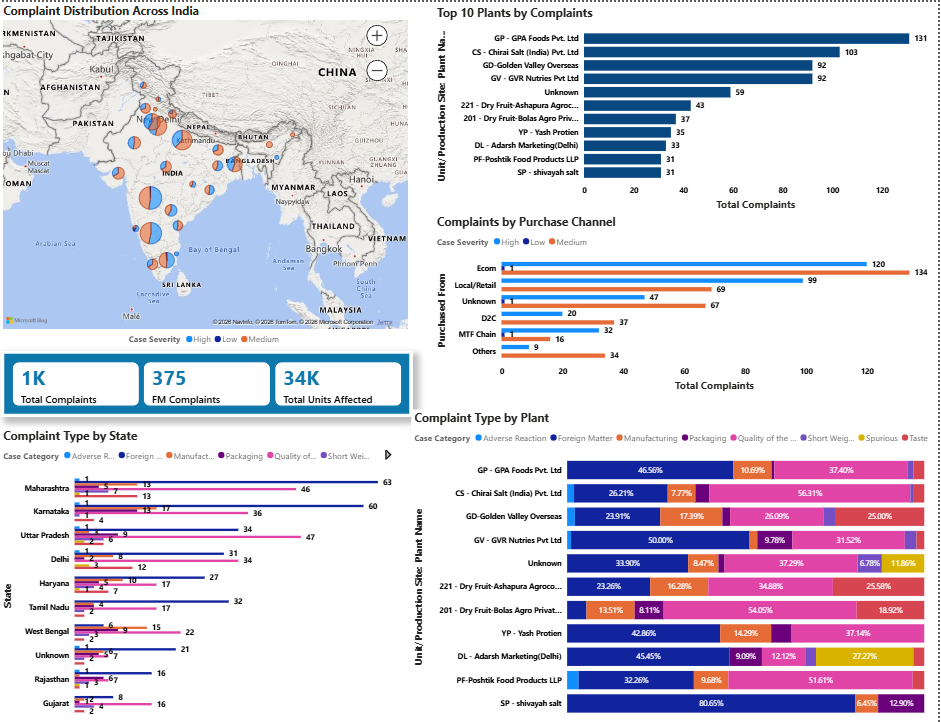

# TATA-Dashboard
# Tata Consumer Products — Complaint Analysis Dashboard

A comprehensive, multi-page interactive Power BI dashboard built to analyze **1,001 consumer complaints** logged against Tata Consumer Products — covering complaint trends, brand-level performance, root cause analysis, resolution tracking, and geographic distribution across India.

---

## Short Description

The Tata Consumer Products Complaint Analysis Dashboard is a data-driven Power BI report designed to help quality assurance teams, operations managers, and business analysts monitor and resolve consumer complaints efficiently. Built on **1,001 rows of complaint data**, the dashboard spans **4 analytical pages** — from high-level KPIs and monthly trends to deep-dive RCA tracking and plant-level supply chain bottlenecks. It is intended for internal stakeholders who need actionable visibility into complaint volumes, severity patterns, brand accountability, and resolution performance across India's food and consumer goods segments.

---
## Tech Stack

The dashboard was built using the following tools and technologies:

- 📗 **Microsoft Excel** 
- 📊 **Power BI Desktop**
- 📂 **Power Query** 
- 🧠 **DAX (Data Analysis Expressions)** 
---

## Data Source

**Source:** Internal Tata Consumer Products Complaint Management System *(Confidential — dataset not shared publicly)*

The dataset contains **1,001 complaint records** covering:
---

## Features / Highlights

### Business Problem

Tata Consumer Products handles thousands of consumer complaints annually across diverse product lines, geographies, and manufacturing partners. Without a centralized view, it is difficult to:

- Identify which brands or product categories are generating the most complaints
- Track whether high-severity cases are being resolved in a timely manner
- Pinpoint which plants or supply chain partners are bottlenecks in resolution
- Measure the quality and completeness of Root Cause Analysis (RCA) across teams
- Understand geographic complaint hotspots for targeted quality interventions

---

### Goal of the Dashboard

To deliver a 4-page interactive analytics tool that:
- Gives leadership an instant snapshot of complaint health via KPIs
- Enables brand managers to drill into complaint types and severity per brand
- Supports quality teams in tracking RCA completion and resolution bottlenecks
- Provides geographic and supply chain intelligence for operational action

---

###  Walkthrough of Key Visuals

---

####  Page 1 — Complaint Overview

**Slicers:** Case Severity | Business Line | Year

**Key KPIs:**
| Metric | Value |
|---|---|
| Total Complaints | 1K |
| Open Cases | 55 |
| Closed Cases | 946 |
| Resolution Rate | 94.51% |
| High Severity Rate | 46.05% |
| RCA Completion Rate | 75.02% |

- **Complaint Status Distribution (Donut Chart)**
  946 cases (94.51%) are Closed; remaining cases span RCA In Progress, Merged, and RCA Under Review — giving an instant health check on case pipeline

- **Monthly Complaint Trend by Severity (Line Chart)**
  Dual-line view of High vs. Medium severity complaints across all 12 months; peaks visible in **August (67 High)** and **September (53 High)** flagging seasonal quality stress periods

- **Top 10 States by Complaints (Bar Chart)**
  **Maharashtra (149)** leads, followed by **Karnataka (132)** and **Uttar Pradesh (108)** — directing regional quality control priorities

- **Top 10 Business Categories by Complaints (Bar Chart)**
  **Salt (368)** and **Pulses (279)** dominate complaint volumes, together accounting for over 64% of all complaints

---

####  Page 2 — Product & Brand Analysis

**Slicers:** Brand/Customer Brand | Business Category | Case Severity

**Key KPIs:**
| Metric | Value |
|---|---|
| FM Complaints | 375 |
| High Severity Cases | 461 |
| Total Units Affected | 34K |

- **Complaints by Brand (Bar Chart)**
  **Tata Sampann (602)** leads by a significant margin over **Tata Salt (329)** — indicating Sampann's larger complaint exposure likely tied to its broader SKU range

- **Severity by Brand (Stacked Bar Chart)**
  Tata Sampann carries **319 Medium** and **281 High** severity cases; Tata Salt shows **170 Medium** and **158 High** — both brands require priority attention

- **Complaint Hierarchy (Treemap)**
  Visual decomposition of complaints from Business Line → Category → Sub-category; Salt and Pulses dominate the Food business line; Nuts leads within Dry Fruits

- **Complaint Type by Brand (Stacked Bar Chart)**
  Breaks down 8 complaint categories per brand:
  - Tata Sampann: Adverse Reaction (223), Quality of Product (209), Packaging (71)
  - Tata Salt: Quality of Product (97), Adverse Reaction (129), Packaging (44)

---

#### Page 3 — RCA & Resolution Analysis

**Key KPIs:**
| Metric | Value |
|---|---|
| RCA Completion Rate | 75.02% |
| Open Cases | 55 |
| High Severity Cases | 461 |

- **RCA Completion Rate (Donut Chart)**
  751 cases (75.02%) have RCA completed; **250 cases (24.98%) still pending** — a critical gap for quality governance

- **Resolution Status by Category (Stacked Bar Chart)**
  Salt has the highest case volume (350) with mixed resolution statuses; Pulses (265) and Nuts (136) follow — helping category managers prioritize closure efforts

- **Root Cause Distribution (Bar Chart)**
  Top root causes:
  - Pending Investigation: **328** cases
  - Factory: **249** cases
  - Quality (Taste) Complaints: **237** cases
  - Others: **168** cases
  - Packing Material: **19** cases

- **Cases Pending With — Bottleneck Analysis (Bar Chart)**
  **Unit/Plant (770)** is the single largest bottleneck, followed by **Not Assigned (220)** — indicating that manufacturing facilities are the primary resolution chokepoint

- **RCA Completion by Brand (100% Stacked Bar)**
  Tata Salt has the lowest RCA completion at **61.70%**; Tata Sampann performs better at **84.88%**; Several smaller brands show 100% completion due to lower volumes

---

#### Page 4 — Geographic & Supply Chain Intelligence

**Key KPIs:** 1K Total Complaints | 375 FM Complaints | 34K Units Affected

- **Complaint Distribution Across India (Bing Map)**
  Bubble map with High/Medium/Low severity color-coding overlaid on Indian geography — cluster density visible across Maharashtra, Delhi NCR, Karnataka, and UP corridors

- **Top 10 Plants by Complaints (Bar Chart)**
  **GP - GPA Foods Pvt. Ltd (131)** leads, followed by **CS - Chirai Salt India (103)** and **GD - Golden Valley Overseas (92)** — these three plants alone account for ~32% of all complaints

- **Complaints by Purchase Channel (Stacked Bar)**
  **E-commerce (134 total)** is the highest complaint channel, followed by **Local/Retail (69)** — signaling that last-mile quality control in online fulfillment needs attention

- **Complaint Type by State (Stacked Bar)**
  Granular view of complaint categories broken down by state — Maharashtra and Karnataka show the most diverse complaint type spread

- **Complaint Type by Plant (100% Stacked Bar)**
  Reveals each plant's complaint profile:
  - GP - GPA Foods: 46.56% Adverse Reaction, 37.40% Quality
  - CS - Chirai Salt: 56.31% Quality of Product
  - GV - GVR Nutries: 50% Adverse Reaction
---

## Dashboard Snapshots

### Page 1 — Complaint Overview

### Page 2 — Product & Brand Analysis

### Page 3 — RCA & Resolution Analysis

### Page 4 — Geographic & Supply Chain Intelligence

---
